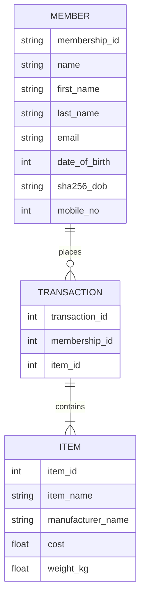

# Data Pipelines

The following lists the steps taken to create the Data Pipeline using Airflow.

## Installation 
### Postgresql
First, we can copy the `docker-compose.yaml` file in provided [link](https://hub.docker.com/_/postgres) and run:
```bash
docker-compose up
```
---

## ERD

