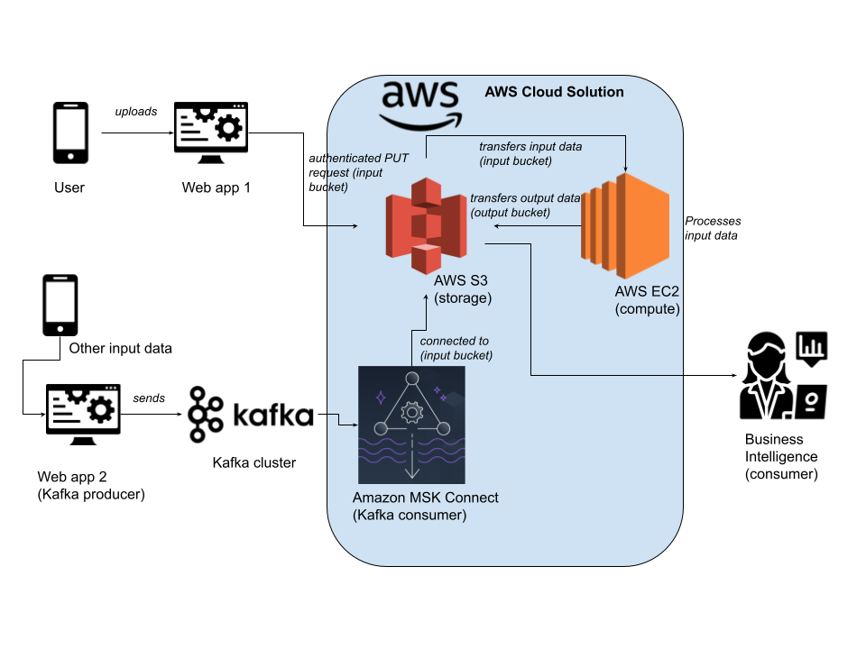

# System Design

The following elaborates about the System Design behind the image upload and processing service.

## Diagram

## Elaboration
### 1. Input
- There are 2 input data source, 1 from a web-app and another from a Kafka queue.
- Web-app can directly perform authenticated PUT requests to upload images into `AWS S3` input bucket.
- However, the Kafka queue might require `Amazon MSK Connect` as a bridge to `AWS S3` input bucket.

### 2. Processing
- We can create 2 buckets in `AWS S3`, an input bucket which collects all unprocessed data and an output bucket that stores all processed data for use.
- The 2 input data source mentioned above data and metadata would be stored in the *input bucket*.
- We can host our image processing appliation on `AWS EC2` which reads and process data from `AWS S3` input bucket before uploading processed data and metadata to a separate *output bucket* on `AWS S3.

### 3. Output
- The Business Intelligence team would then be provided with the `AWS S3` output bucket endpoint to query data according to their needs.