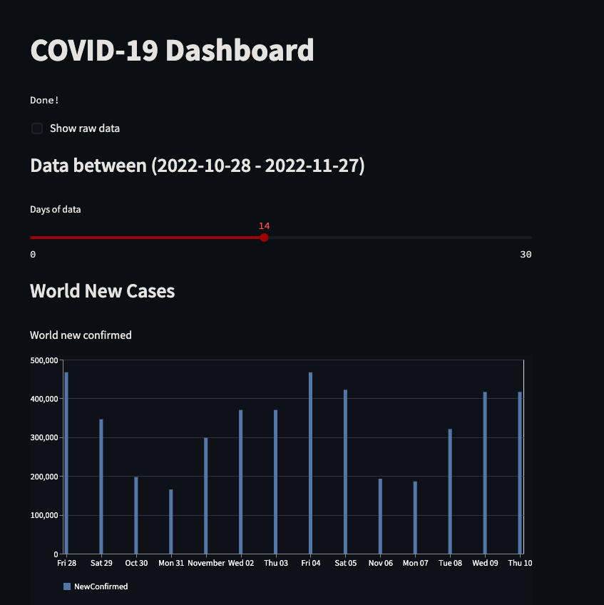

# Charts and API

The COVID-19 dashboard which queries from is hosted at the following Streamlit site:
https://tonyngmk-data-engineer-tech-challenge-4-charts-apiapp-vde1c9.streamlit.app/

## Examples
| Sample of dashboard interface

## API
| Utilised Python `requests` library for calling `GET` request from API.

- API Source: https://covid19api.com/
- API Endpoint Documentation: https://documenter.getpostman.com/view/10808728/SzS8rjbc

## Dashboard
| Used Streamlit to build interative dashboard.
- Streamlit: https://streamlit.io/